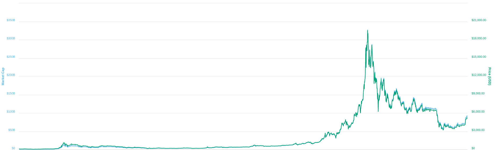

# :mortar_board: THEORIE: _Cryptocurrencies_

## Cryptocurrency = Währungssystem basierend auf Kryptographie

[Asymmetrische Kryptographie](https://de.wikipedia.org/wiki/Asymmetrisches_Kryptosystem) - public / private key pair

(sehr) grob vereinfacht:
- public key ~ Kontonummer
- private key ~ PIN

## Im Fall von Bitcoin:
- [ECDSA](https://de.wikipedia.org/wiki/Elliptic_Curve_DSA) Elliptic Curve Digital Signature Algorithm
- Elliptic curve _Secp256k1_
  * vor Bitcoin fast nie benutzt
  * optimiert für effiziente Berechnung
  * anders als bei [NIST-Kurven](https://en.wikipedia.org/wiki/Dual_EC_DRBG) kein Backdoor-Verdacht
  * auch in vielen anderen Cryptocurrencies benutzt: _Ethereum_, _EOS_, _Litecoin_, _Dash_, ...
- private key = Random 256bit
- public key = RIPEMD-160(SHA256(private key)) = Adresse

## Bitcoin Kursentwicklung

## Bitcoin Forks (Split Coins)
 - Bitcoin Cash: Fork bei Block 478558, 1.8.2017, (BTC->BCH)
 - Bitcoin Gold: Fork bei Block 491407, 24.10.2017, (BTC->BTG)
 - Bitcoin SV: Fork bei Block 556766, 15.11.2018 (BCH->BSV)
 - plus zig andere eher unbedeutende

## Versehentliche Bitcoin Forks
 - März 2013 Chain Fork (v0.7/v0.8)
 - CVE-2018-17144 (Bitcoin 0.15 double spending Bug, wurde nicht ausgenutzt)