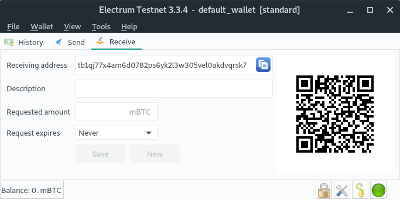

# Hands on: Bitcoin wallet erstellen mit Electrum

### "Electrum" starten

    > electrum --testnet

### Weiterklicken bis hier:

### Die 12 "seed words" abschreiben

### ... und neu eintippen

### Password vergeben

### Bitcoins erhalten

- "Receive", Adresse kopieren 

- Bei "Coinfaucet" Testnet-Bitcoins anfordern

  [https://coinfaucet.eu/en/btc-testnet/](https://coinfaucet.eu/en/btc-testnet/)
  
- Captcha lösen

- Bestätigung

- Transaktion im Block-Explorer verfolgen

 - ... warten