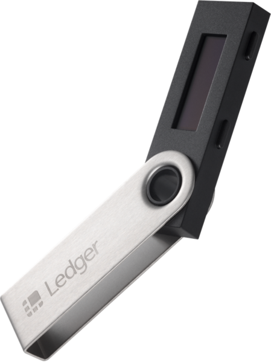
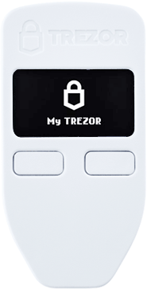
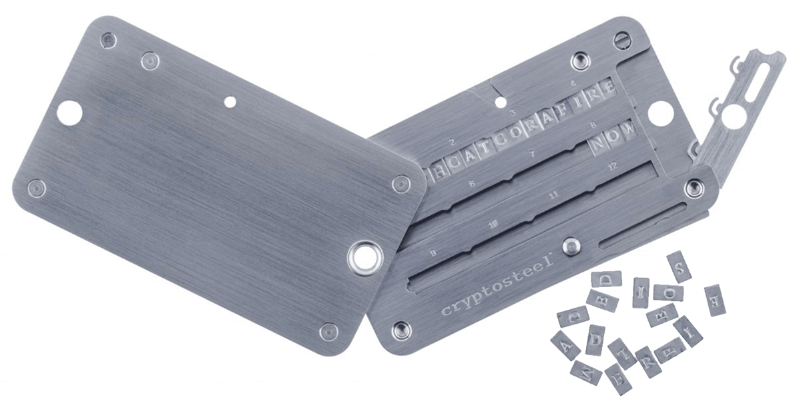

# OPSEC (Operational security)
- Schutz des private key liegt in eigener Verantwortung
- Gefahren vielfältig: Verlust, Phishing, Trojaner, ...

##  was hilft?
- sicherer Computer, sicherer Browser, sichere Software
- Website-Zertifikate checken
- sichere Passwörter (Password-Manager)
- 2FA (möglichst nicht per Handy)
- Backups (offline, offsite)
- Paranoia

# Wallet-Varianten
- Software, z.B. _Electrum_, _bitcoind_
- Mobile apps, z.B. [Mycelium](https://play.google.com/store/apps/details?id=com.mycelium.testnetwallet)
  
  

- Web-Wallets / Paper wallets

  [https://www.bitaddress.org/](https://www.bitaddress.org/bitaddress.org-v3.3.0-SHA256-dec17c07685e1870960903d8f58090475b25af946fe95a734f88408cef4aa194.html?testnet=true)
  
  [https://bitcoinpaperwallet.com/](https://bitcoinpaperwallet.com/bitcoinpaperwallet/generate-wallet.html?design=alt-testnet)
  
  

- Hardware wallets

  [Ledger](https://www.ledger.com/products/ledger-nano-s)
  
  
  
  [Trezor](https://shop.trezor.io/product/trezor-one-white)
  
  
  
  [Cryptosteel](https://shop.trezor.io/product/cryptosteel)
  
  