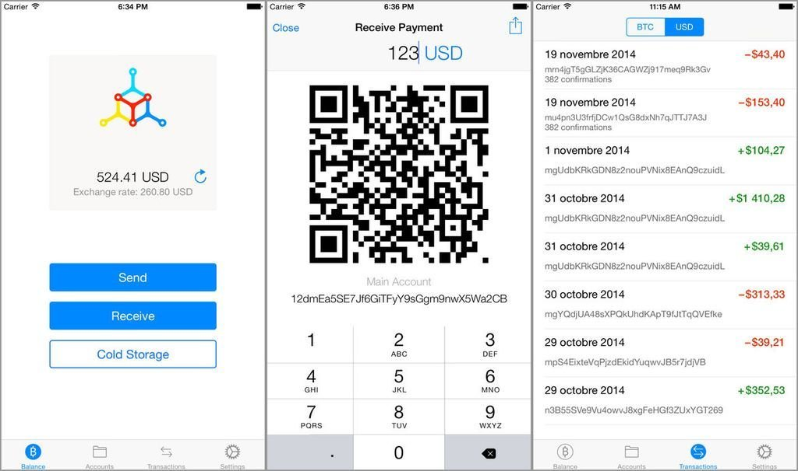
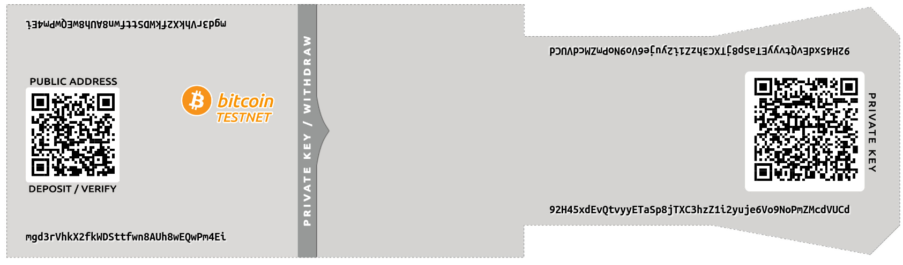
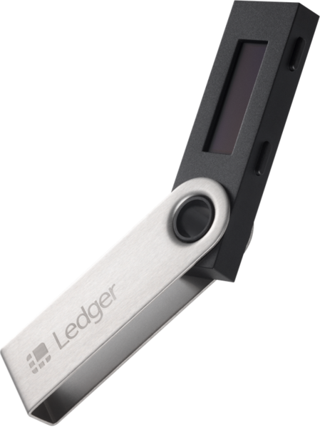
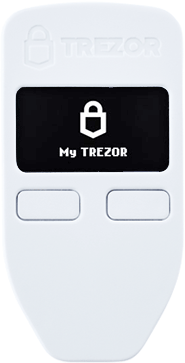
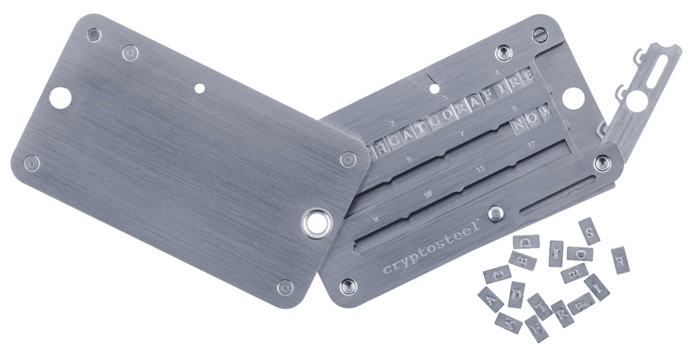

# :mortar_board: THEORIE: _OPSEC (Operational security)_

## Kryptographie ersetzt die Bank
- Schutz des _private key_ liegt in eigener Verantwortung
- Gesetzte der Mathematik sind hart & unnachgiebig
- Gefahren vielfältig: Verlust, Phishing, Trojaner, ...

### Meet James Howell 🤡:

- 
##  Was hilft?
- sicherer Computer, sicherer Browser, sichere Software
- Website-Zertifikate checken
- sichere Passwörter
- 2FA (möglichst nicht per Handy)
- Backups (offline, offsite)
- ein gesundes Maß Paranoia

# Wallet-Varianten
- Software, z.B. [_bitcoind_](https://github.com/bitcoin/bitcoin/), [_Electrum_](https://github.com/spesmilo/electrum/)
- Mobile apps, z.B. [Mycelium](https://play.google.com/store/apps/details?id=com.mycelium.testnetwallet)
  
  

- Web-Wallets / Paper wallets

  [https://www.bitaddress.org/](https://www.bitaddress.org/bitaddress.org-v3.3.0-SHA256-dec17c07685e1870960903d8f58090475b25af946fe95a734f88408cef4aa194.html?testnet=true), [https://bitcoinpaperwallet.com/](https://bitcoinpaperwallet.com/bitcoinpaperwallet/generate-wallet.html?design=alt-testnet)
  
  

- Hardware wallets

  [Ledger](https://www.ledger.com/products/ledger-nano-s)
  
  
  
  [Trezor](https://shop.trezor.io/product/trezor-one-white)
  
  
  
  [Cryptosteel](https://shop.trezor.io/product/cryptosteel)
  
  