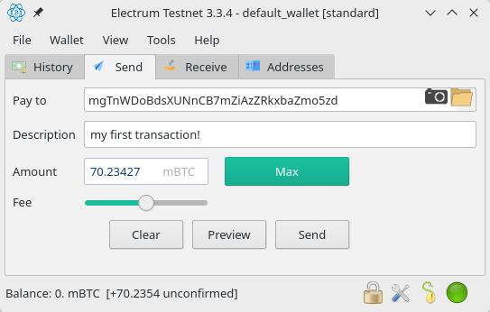

# :construction_worker: HANDS-ON: Bitcoin-Transaktion ausführen

Transaction vom Faucet hoffentlich inzwischen angekommen?

## Mit dem Electrum Wallet...

    electrum --testnet

## ...Funktion "Send"

# Fortschritt beobachten: Block Explorer
- https://live.blockcypher.com/btc-testnet/