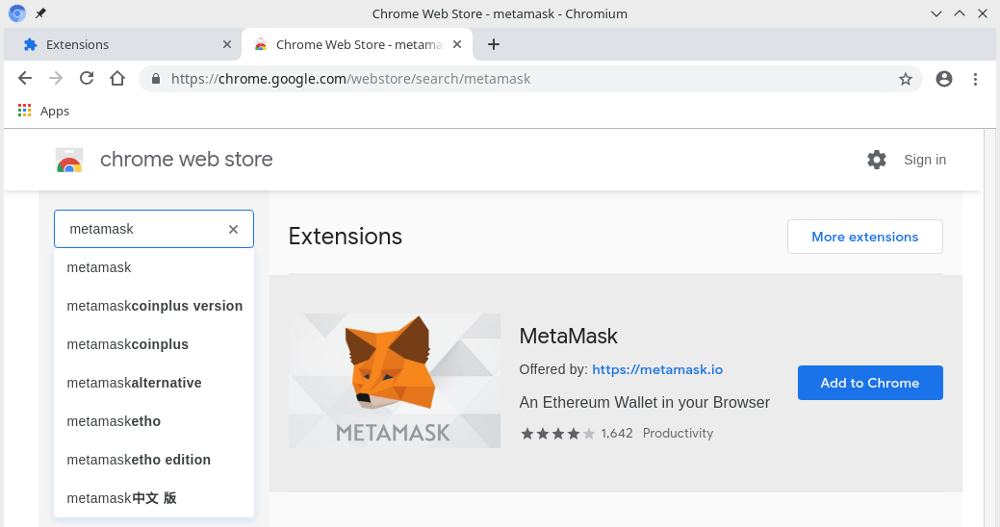
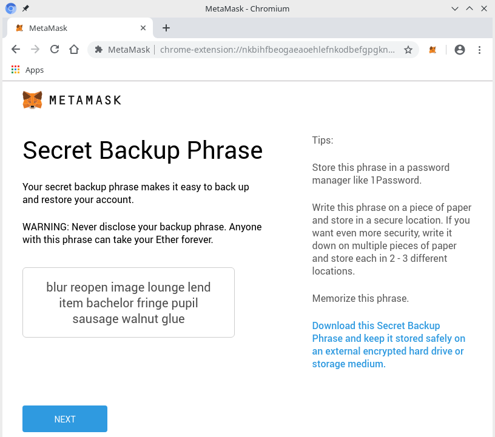
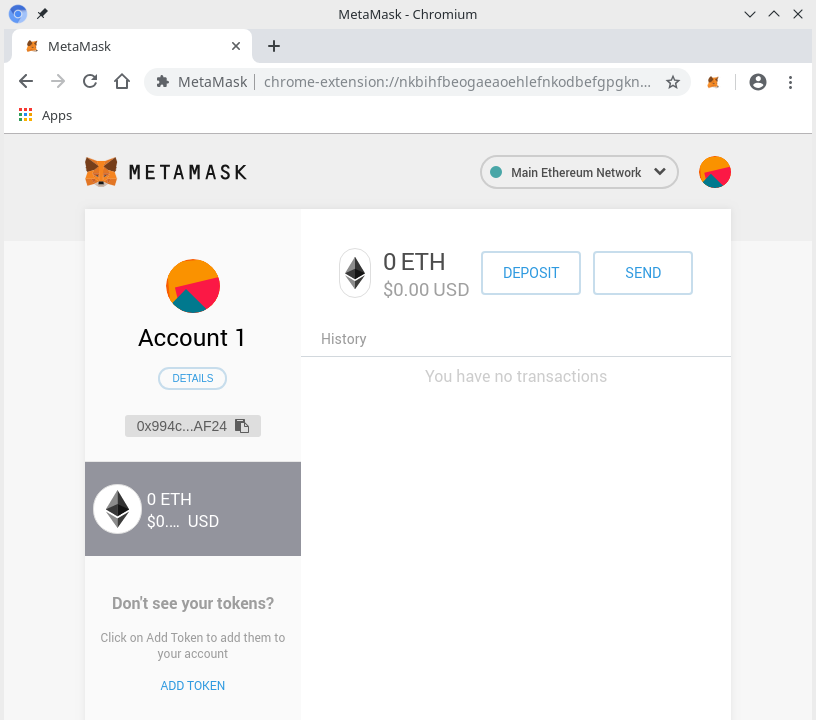

# :construction_worker: HANDS-ON: Interaktion mit dem Contract

## Browser-Addon _Metamask_ einrichten

- Metamask Addon installieren  
  Menu -> More Tools -> Extensions -> Chrome Web Store -> Metamask -> Add to Chrome
  

  
## Wallet anlegen  
- "Get started" -> "Create a wallet" -> "No thanks"
- Passwort vergeben: z.B. "abcd1234"
- Checkbox setzen, "Create"
- "Secret Words" abschreiben und im nächsten Screen wieder eintragen

- "All done"

## Testnet-Ether anfordern

    ./get-ropsten-eth.sh <my-ethereum-address>
	
## Interaktion mit Contract

UI unter http://127.0.0.1:4200/