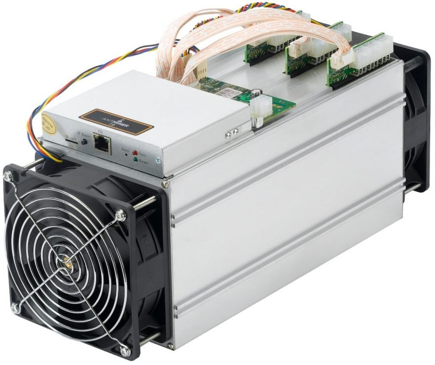
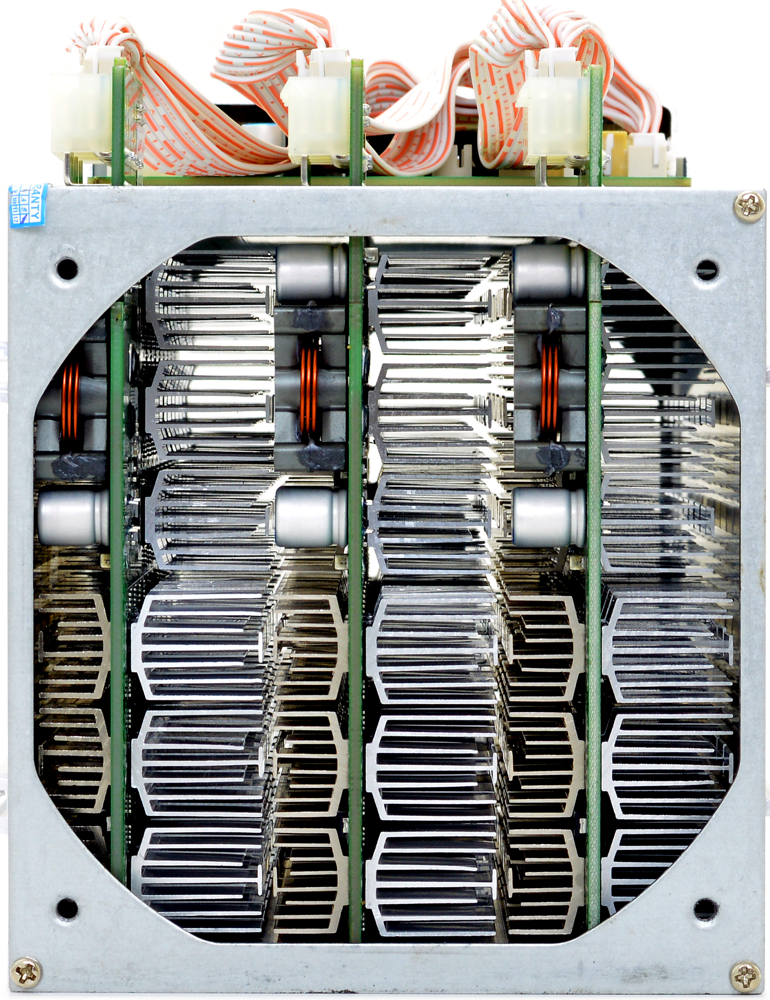
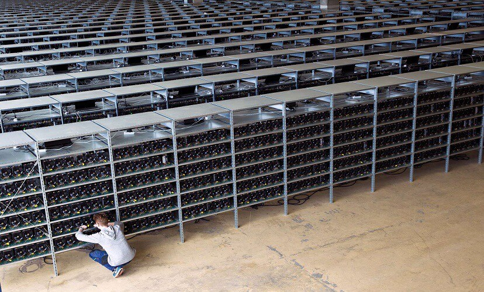

# :mortar_board: THEORIE: _Mining_

## Cryptocurrencies "verbrennen" Rechenleistung in gigantischem Ausmaß für _Proof-of-Work (PoW)_
## Mining absichtlich ineffizient

## Mining heute:

### Bitcoin: ASICS haben CPUs, GPUs verdrängt

Beispiel Bitmain Antminer S9
- 14 TH/s
- 189 Chips
- 1.5 kW elektrische Leistung

Innenansicht:

3 dicht gepackte Boards mit ASICs:

### Mining im industriellen Maßstab

### Andere Cryptocurrencies wehren sich gegen ASICs

- Ethereum: PoW-Algorithmus Ethash ist Memory-hard
- Monero: mehrere Hardforks mit Änderung des PoW-Algorithmus (Cryptonight)

Ständiges Katz-und-Maus-Spiel zwischen ASIC-Herstellern und Entwicklern

Solo-Mining vs. Pool-Mining